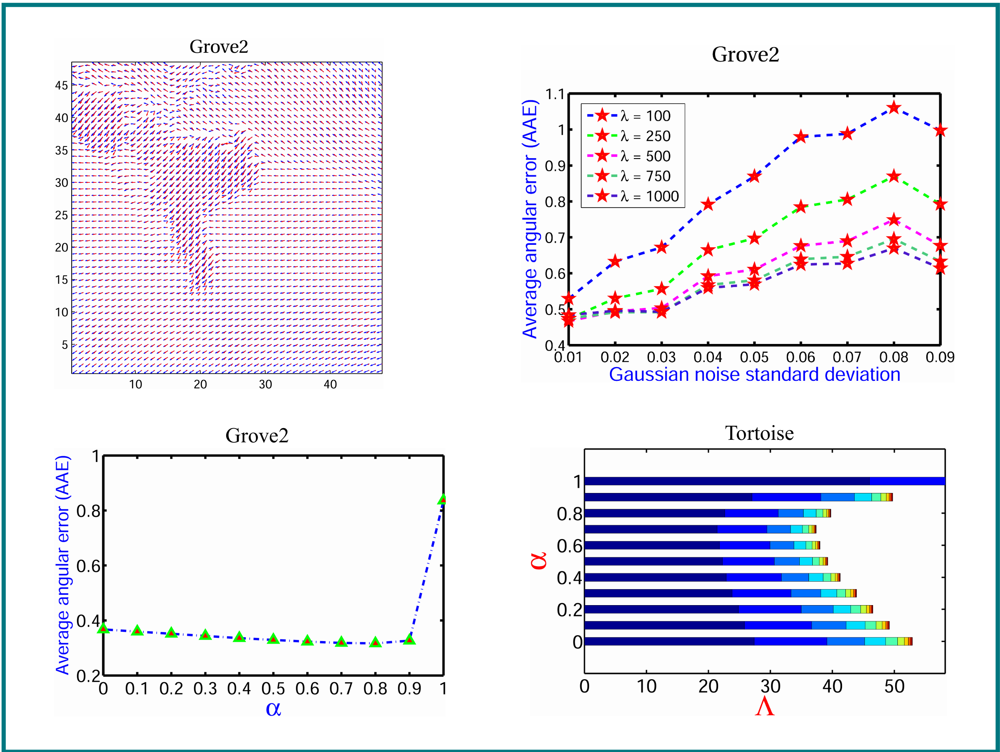

# A Nonlinear Modeling of Fractional Order Based Variational Model in Optical Flow Estimation

**Authors:** Muzammil Khan\*, Pushpendra Kumar  

## 📄 [Read the Full Article](https://www.sciencedirect.com/science/article/pii/S0030402622004958)

## Abstract  
<p align="justify">
In this paper, a nonlinear fractional order variational (NFOV) model is introduced to estimate  
the optical flow. In particular, the presented model can be scaled to the existing integer  
order variational models. The proposed variational functional is designed by combining a  
non-quadratic Charbonnier norm-based data term and a Marchaud fractional derivative-based  
regularization term. This non-quadratic penalty is robust against outliers, whereas the nonlocal  
character of the Marchaud fractional derivative leads the model to deal with the discontinuous  
information about texture and edges, yielding a dense flow field.
</p>
<p align="justify">
The numerical discretization of the Marchaud fractional derivative is carried out with the help of  
the Grünwald–Letnikov fractional derivative. The discretized nonlinear system is further reduced  
to a linear system of equations by employing an outer fixed-point iteration scheme and is finally  
solved with an efficient iterative technique. The experiments are performed over a variety of datasets.  
</p>
<p align="justify">
The performance of the model is tested using different error measures (AAE, AEE, AENG, WE)  
depending upon the availability of the ground truth (GT) flow. The robustness of the NFOV model  
is shown under different amounts of noise along with the variation of the smoothing parameter.  
</p>
<p align="justify">
A detailed comparison with recently published works is presented to demonstrate the efficiency  
and accuracy of the proposed model.
</p>

## Figure  
<div style="display: flex; justify-content: center;">
<table>
    <tr>
        <td></td>
    </tr>
    <tr>
        <td align="center"><strong>Figure 1:</strong> Estimated optical flow fields corresponding to Grove2 and Tortoise datasets in terms of color maps and vector plots.</td>
    </tr>
</table>
</div>

<br><be>

<div style="display: flex; justify-content: center;">
<table>
    <tr>
        <td></td>
    </tr>
    <tr>
        <td align="center"><strong>Figure 1:</strong> GT vectors overlapped with the estimated vectors (top left); influence of smoothing parameter over added noise (top right); effect of fractional order $\alpha$ on AAE (bottom left) and WE (bottom right).</td>
    </tr>
</table>
</div>

---

## Citation

If you use our code in your research, please consider citing our work using the following BibTeX entry:

```bibtex
@article{khan2022nonlinear,
  title={A nonlinear modeling of fractional order based variational model in optical flow estimation},
  author={Khan, Muzammil and Kumar, Pushpendra},
  journal={Optik},
  volume={261},
  pages={169136},
  year={2022},
  publisher={Elsevier}
}


